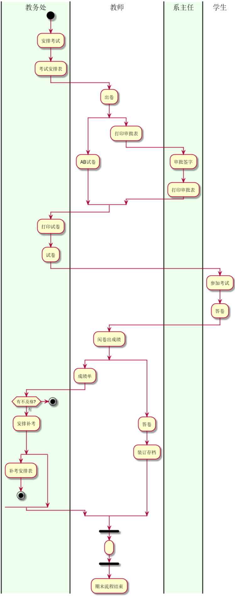
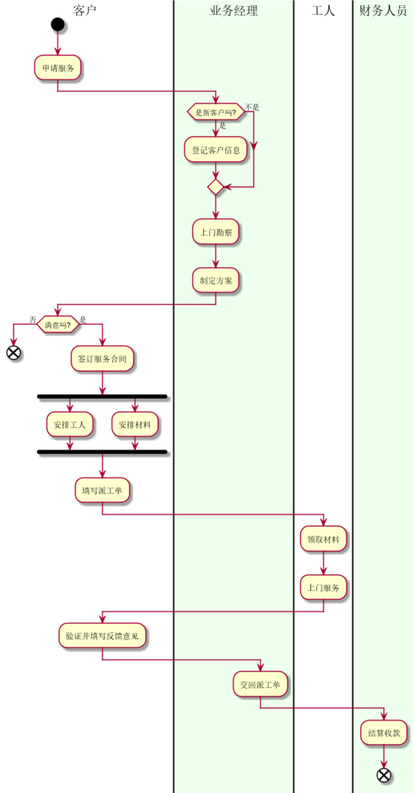

# 实验1：业务流程建模
|学号|班级|姓名|
|:-------:|:-------------: | :----------:|
|201510414125|2015级软件工程1班|杨钉权|

#### Page107图6.1: 考试及成绩管理流程
**plantUML：**
```
@startuml
|教务处|
start
:安排考试;
:考试安排表;
|教师|
:出卷;
split
    :AB试卷;
split again
    :打印审批表;
    |系主任|
    :审批签字;
    :打印审批表;
end split
|教务处|
:打印试卷;
:试卷;
|学生|
:参加考试;
:答卷;
|教师|
:阅卷出成绩;
split
    :成绩单;
    |教务处|
    if (有不及格?) then(有)
        :安排补考;
    else()
        stop
    endif
    split
        :补考安排表;
        stop
    split again

    end split
split again
    |教师|
    :答卷;
    :装订存档;
end split
|教师|
fork
    : ;
end fork
:期末流程结束;
@enduml
```
**效果图：**

**注：**
```
采用split让业务分成两条线
```

#### Page108图6.2: 客户维修服务流程
**plantUML：**
```
@startuml
|客户|
start
:申请服务;
|#efe|业务经理|
if(是新客户吗?) then(是)
    :登记客户信息;
else(不是)
endif
:上门勘察;
:制定方案;
|客户|
if(满意吗?) then(否)
    end
else(是)
    :签订服务合同;
    fork
        :安排工人;
    fork again
        :安排材料;
    end fork
    :填写派工单;
    |工人|
    :领取材料;
    :上门服务;
    |客户|
    :验证并填写反馈意见;
    |业务经理|
    :交回派工单;
    |#efe|财务人员|
    :结算收款;
    end
@enduml
```
**效果图：**

**注：**
```
采用fork实现同步业务流
```