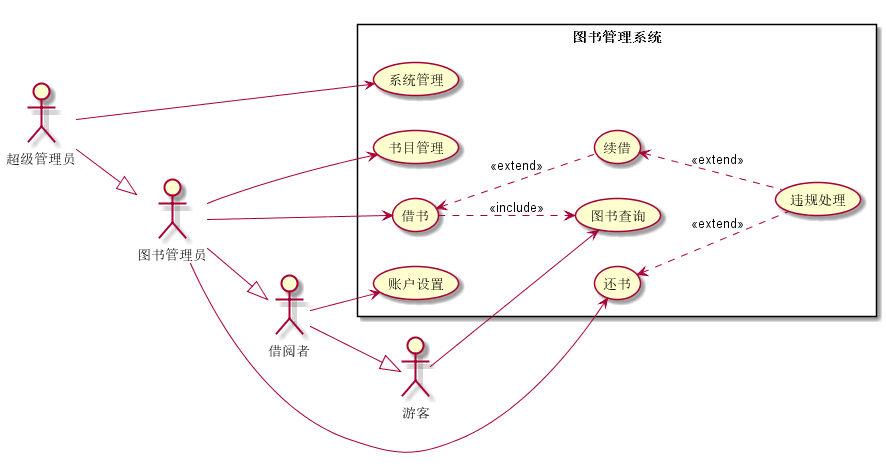

# 实验二:图书管理系统

## 图书管理系统用例图
**代码过长不在README.md中列出,查看请点击链接**
[*查看用例图代码(点这里)*](../out/test2/bookMange/图书管理系统用例图.png)
## 
*用例图说明*
~~~
    1. 借书用例包含图书查询用例(借书需要先查询书所借书籍的基本信息才能进行下一步操作)
    2. 续借是借书的拓展(只有借了书并且借书日期快到借阅者还需要进行借阅才会发生的操作)
    3. 同时,续借和还书都有拓展用例违规处理(续借或还书时都要求检查书籍完整性,在满足条件情况下才会触发违规处罚操作)
    2. 游客,并非图书管理系统某提特定用户,代指一切未登录到系统,却进入系统界面的人,其拥有基本系统最基本的角色权限:查询图书(从数据库中查询图书,但不能进行其他操作,姚进行其他操作会弹出登录验证界面)
    2. 借阅者,是本系统的基础用户,也是用户群体最多的角色,其基本上不具备线上功能,主要用于存储借阅者在本图书管理系统中的操作历史,为借数提供依据.用户点击用户设置查看自身的借阅记录以及处罚记录等
    3. 图书管理员,系统行为的主要参与者,负责审批借阅者借书/还书/续借等操作,对借阅者违规行为进行处罚,管理书目(维护图书书目的正确性,保证书籍信息与真实信息一一对应),向系统管理员发送错误信息以便维护系统正常运行
    4. 超级管理员,主要工作是处理系统在运行过程中出现的小bug保证系统的正常运行,定期维护系统,维护用户资料,为了方便维护可以进行其他角色的任何操作.
~~~
## 图书管理系统用例规约表
[*详情请点击这里*](usecaseTable.md)
## 用例流程说明
[*详情点击这里*](instruction.md)
