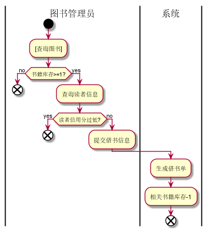
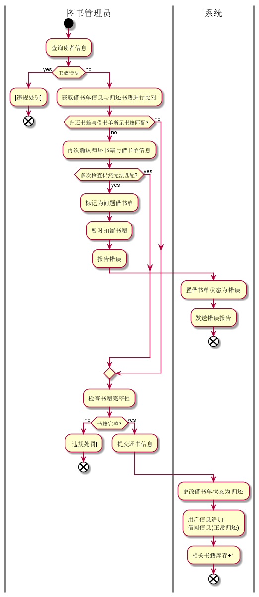
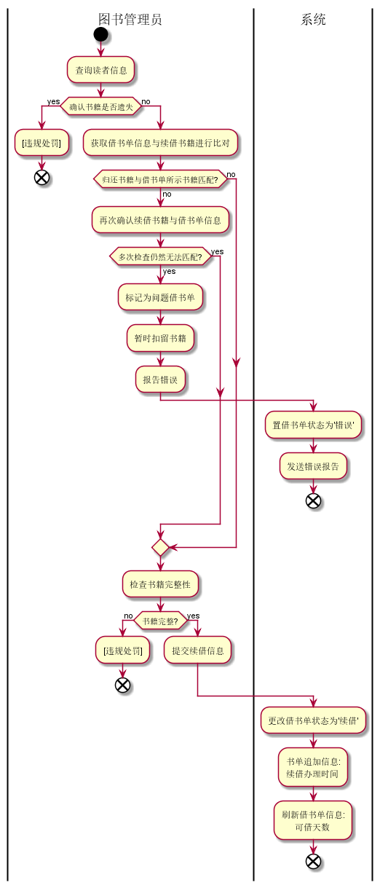
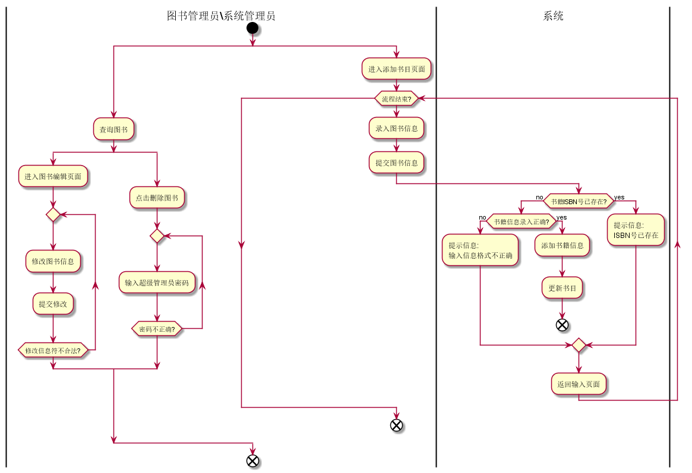

*说明*
**以下几个流程图代码位于test2的bookMange.pu文件里面,不再次在这里列出**
[*查看代码*](bookMange.pu)
### 借书用例流程图

### 还书用例流程图

### 续借用例流程图

### 书目管理用例流程图

*说明*
~~~
    1.从用例的流程图可以看出,本系统中许多判断有角色自行作出,而非靠系统进行逻辑判断,目的是减少系统资源的使用,提高系统的灵活度,提高用户的参与度.
    2.流程图中用[***]表示该用例的流程中涉及到其它用例流程,于是将其简写不再在该流程中进行详细展开
    3.在借书书目管理流程图中,添加书籍里面的那个循环只是从if判断返回到录入书目前面,那里没有本来没有所谓流程结束再继续分支到结束,因为找不到合适的循环语句描述于是写成那样
~~~