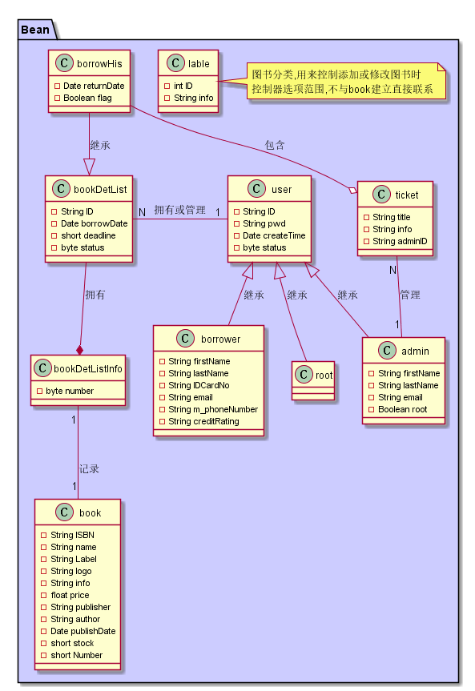
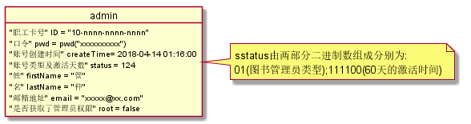

# 实验3:图书管理系统领域对象建模
## 1.图书管理系统类图
### 1.1图示
[上一版本的图示](../out/test3/classView/classView.png)

### 1.2代码
[点击查看](classView.pu)
### 1.3说明
<pre>
    1. 类图中各个类的中文意义在"图书管理系统对象图"的代码说明中给出
    2. 类图中直接继承过来的属性不再在子类中写出
    3. 从图中看出,Bean中的类基本对应Test 2中用例或流程图中所需要的实体,service中的类对应于其中涉及到的操作所需的方法
    4. 图中大部分线是真的表示的类之间的关系(大概?),有些线是词穷(也许)
    5. 由于继承关系,未覆盖的属性或方法不再列出
       由于篇幅关系,省略类的set/get方法
    6. 类图与来源跟踪:
        borrower-修改->用例:系统管理
        admin-修改->用例:系统管理
        root-->emmmm不知道这么说...
        book-创建/使用/修改->用例:借书/书目管理/图书查询等
        bookDetList-创建->用例:借书-借书单
        bookDetListInfo-创建->用例:借书-借书单的补充项目
        borrowHis-创建->流程:还书等流程-借书记录
        bookMenu-创建/使用->用例:书目管理-书目
        bookinfo-创建/使用->用例:书目管理-书目每条项
        ticket-创建->用例违规处理

</pre>

## 2.图书管理系统对象图
### 2.1.说明
~~~
    1. 在下面对象图中的看见的仅由'x'/'n'/'-'等组成或者一连串的他们的例子,那一定是作者懒得想例子用他们代替.
    2. 其中的"n"表示任意数字;"x"表示任意数字/中文/字母;"-"用于用在以上两者之间起分割作用
    3. 总图什么的不可能有的,和类图差不多干嘛画
    4. 口令项:"口令" pwd = pwd("xxxxxxxxxx")表示用加密算法'pwd()'将用户输入的密码'xxxxxxxxxx'加密再存储
~~~
### 2.2.对象图展示
#### 2.2.1.借阅者对象图
~~~
代码及说明:
    @startuml borrower
    object borrower{
        "借书卡号" ID = "01-nnnn-nnnn-nnnn"
        "口令" pwd = "xxxxxxxxxx"
        "账号创建时间" createTime= 2018-04-14 01:16:00
        "账号类型及激活天数" status = 188
        "姓" firstName = "张"
        "名" lastName = "五"
        "身份证号码" IDCardNo = "nnnnnn-nnnn-nn-nn-nnnx"
        "邮箱地址" email = "xxxxx@xx.com"
        "电话号码" m_phoneNumber = "nnn-nnnn-nnnn"
        "信用评级" creditRating = 100
    }
    note right: status由两部分二进制数组成分别为:\n10(读者类型);111100(60天的激活时间)
    @enduml

    1.借书卡号为借阅者登录系统的唯一凭证,其一01开头,加上三组四位的数字组成
    2.口令是登录验证登录操作是否是本人的唯一凭证,由8到20位字母数字组成
    3.status中,借阅者前两位bit不变,后面6bit表示1到60天的激活时间,当时间小于1时,账号会被锁死,需要申请解锁.每次借书都会刷新时间
    4.基础分数为100,不同分段影响借阅者借书能力.
~~~

#### 2.2.2.图书管理员对象图
~~~
代码及说明:
    @startuml admin
    object admin{
        "职工卡号" ID = "10-nnnn-nnnn-nnnn"
        "口令" pwd = "xxxxxxxxxx"
        "账号创建时间" createTime= 2018-04-14 01:16:00
        "账号类型及激活天数" status = 124
        "姓" firstName = "管"
        "名" lastName = "仲"
        "邮箱地址" email = "xxxxx@xx.com"
        "是否获取了管理员权限" root = false
    }
    note right: sstatus由两部分二进制数组成分别为:\n01(图书管理员类型);111100(60天的激活时间)
    @enduml

    1.借书卡号为借阅者登录系统的唯一凭证,其一01开头,加上三组四位的数字组成
    2.root为ture时如类图中所示,图书管理员才可以对系统进行一些删改操作,以保证数据安全
~~~

#### 2.2.3.超级管理员对象图
~~~
代码及说明:
    @startuml root
    object root{
        "管理号" ID = "r0-xxxx-xxxx-xxxx"
        "口令" pwd = "xxxxxxxxxx"
        "账号创建时间" createTime= 2018-04-14 01:16:00
        "账号类型及激活天数" status = 63
    }
    note right: sstatus由两部分二进制数组成分别为:\n00(超级管理员类型);111111(永久激活)
    @enduml
    
    1. 为系统账号,故无特殊属性.
~~~

#### 2.2.4.图书对象图
~~~
代码及说明:
    @startuml book
    object book{
        "ISBN号" ISBN = "978-7-308-17148-9"
        "书名" name = "Linux程序设计"
        "分类" Label = "计算机-Linux编程-基础教材"
        "封面图片" logo = "/xxx/xxxx/xxxx.webp"
        "简介" info = "一本简单明了的Linux搞程序开发的编程基础"
        "价格" price = 78.00元
        "出版社" publisher ="浙江大学出版社"
        "作译者" author = "金国庆 刘加海 李江明 谢井"
        "出版日期" publishDate = 2017-9
        "剩余量" stock = 6
        "总数" Number = 7
    }
    @enduml

    1. 然而并没有什么特别的...
    2. logo存储的时图片在服务器上的地址
~~~

#### 2.2.5.借书单对象图
~~~
代码及说明:
    @startuml bookDetList
    object bookDetList{
        "借书单号" ID = nnnnnnnnnnnnnnnn
        "借书卡号" ID = "01-nnnn-nnnn-nnnn"
        "借书日期" borrowDate = 2018-04-14 01:16:00
        "还书日期" returnDate = null
        "还书限期" deadline = 30
        "书单状态" status = 1
    }
    object bookDetListInfo{
        "ISBN号" ISBN = "978-7-308-17148-9"
        "借书数量" number = 1
    }
    bookDetList "1" --* "N" bookDetListInfo:拥有
    @enduml

    1. 考虑到一次借书可能会借出多本书,所以分成书单和详单两部分
    2. 借书单表示为借书状态时就一定没还书(大概?),故还书日期为空
    3. 还书期限表示即结束日起,截至n天后为正常借书,超过仍为办理续借或者还书视为逾期
(初始默认期限的10天,一次最多续借10天,最大不超过30天,再多直接还了再借吧...)
    4. 书单由多种状态,不同状态时表示为不同意义...1:正常借出(还包含续借);2:正常归还;3:逾期归还;4:遗失;5~7:损坏(数字越大损坏等级越严重)
    5. 对于number,一次借书操作借出相同书籍不得超过3本,故用byte型
~~~

#### 2.2.6.借书历史对象图
~~~
代码及说明:
    @startuml borrowHis
    object borrowHis{
        "借书单号" ID = nnnnnnnnnnnnnnnn
        "借书卡号" ID = "01-nnnn-nnnn-nnnn"
        "借书日期" borrowDate = 2018-04-14 01:16:00
        "还书日期" returnDate = 2018-04-14 01:16:00
        "还书限期" deadline = 30
        "书单状态" status = 2
        "处罚标记" flag = true
    }
    object bookDetListInfo{
        "ISBN号" ISBN = "978-7-308-17148-9"
        "借书数量" number = 1
    }
    borrowHis "1" --* "N" bookDetListInfo:拥有
    object ticket{
        "借书单号" ID = nnnnnnnnnnnnnnnn
        "处罚标题" title = XXX
        "处罚明细" info = "xxxxxxxxxxxx"
        "处理人" adminID = "10-nnnn-nnnn-nnnn"
    }
    borrowHis "1" --o "N" ticket:包含
    @enduml

    1. 借书历史基本上由书单转换,所以基本上相似(除了借书单状态)
    2. 附加了一个处罚标记,为真时表示存在违规处罚,默认处罚日期为还书当时(进行了处理并提交了才形成的借书历史啊)
    3. 处罚明细ticket中的内容简单易懂(大概?)
~~~

#### 2.2.7.书目对象图
~~~
代码及说明:
    @startuml bookMenu
    object bookinfo{
    "ISBN号" ISBN = "978-7-308-17148-9"
        "书名" name = "Linux程序设计"
        "分类" Label = "计算机-Linux编程-基础教材"
    "出版社" publisher ="浙江大学出版社"
        "作译者" author = "金国庆 刘加海 李江明 谢井"
    }
    object bookMenu{
        ArrayList<bookMenu>
    }
    bookMenu "1" --* "N" bookinfo
    @enduml

    1. 就是存到内存方便查找的几个简单书籍目录?
    2. 分类什么的,按照一级分类-二级分类-三级分类-...拼起来的,要用到时再取对应的...
~~~

