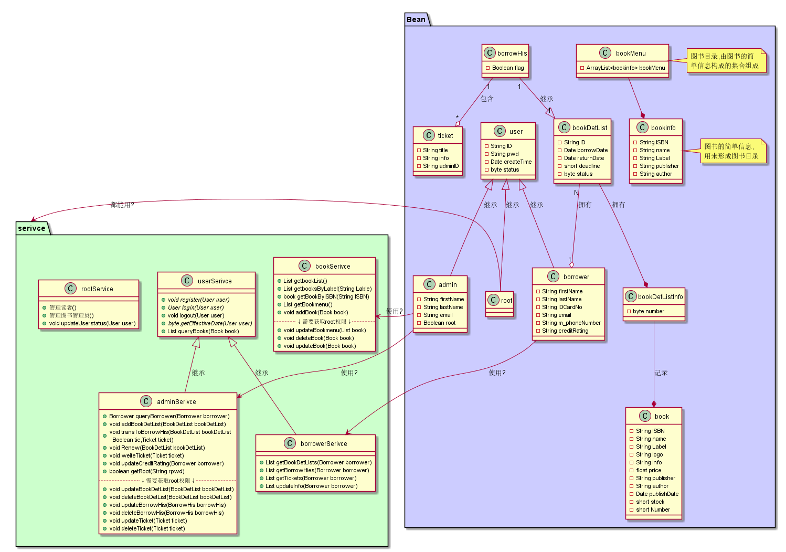
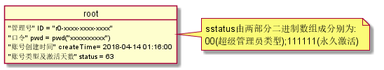
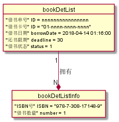

# 实验3:图书管理系统领域对象建模
## 1.图书管理系统类图
### 1.1图示

### 1.2代码
[点击查看](classView.pu)
### 1.3说明
<pre>
    1.类图中各个类的中文意义在"图书管理系统对象图"的代码说明中给出
    2.类图中直接继承过来的属性不再在子类中写出
    3.从图中看出,Bean中的类基本对应Test 2中用例或流程图中所需要的实体,service中的类对应于其中涉及到的操作所需的方法
    4.图中大部分线是真的表示的类之间的关系(大概?),有些线是词穷(也许)
</pre>

## 2.图书管理系统对象图
### 2.1.说明
~~~
    1.在下面对象图中的看见的仅由'x'/'n'/'-'等组成或者一连串的他们的例子,那一定是作者懒得想例子用他们代替.
    2.其中的"n"表示任意数字;"x"表示任意数字/中文/字母;"-"用于用在以上两者之间起分割作用
~~~
### 2.2.对象图展示
#### 2.2.1.借阅者对象图

#### 2.2.2.图书管理员对象图

#### 2.2.3.超级管理员对象图

#### 2.2.4.图书对象图

#### 2.2.5.借书单对象图

#### 2.2.6.借书历史对象图

#### 2.2.7.书目对象图

