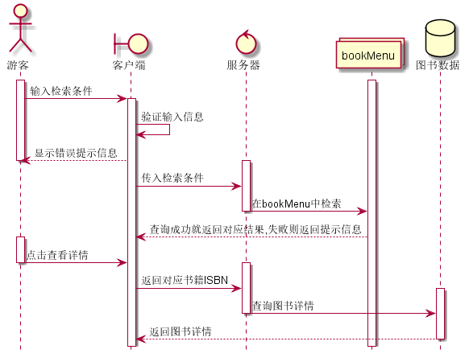

# 实验四 图书管理系统顺序图绘制
## 图书查询
### 代码
~~~
@startuml 图书查询
hide footbox
actor 游客
boundary 客户端
control 服务器
collections bookMenu
database 图书数据

activate 游客
activate bookMenu
游客 -> 客户端: 输入检索条件
activate 客户端
客户端 -> 客户端: 验证输入信息
客户端 --> 游客: 显示错误提示信息
deactivate 游客
activate 服务器
客户端 -> 服务器: 传入检索条件
服务器 -> bookMenu: 在bookMenu中检索
deactivate 服务器
bookMenu --> 客户端: 查询成功就返回对应结果,失败则返回提示信息
activate 游客
游客 -> 客户端: 点击查看详情
deactivate 游客
activate 服务器
客户端 -> 服务器: 返回对应书籍ISBN
activate 图书数据
服务器 -> 图书数据: 查询图书详情
deactivate 服务器
图书数据 --> 客户端: 返回图书详情
deactivate 图书数据
@enduml
~~~

### 图例

### 说明
~~~

~~~

## 借书
## 续借
## 还书
## 违规处理
## 书目管理

## 系统管理
## 账户设置(用户自身)