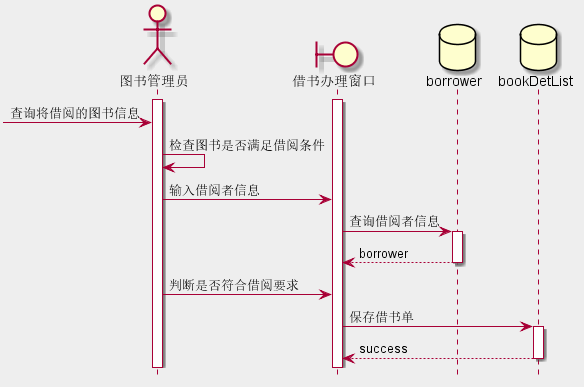
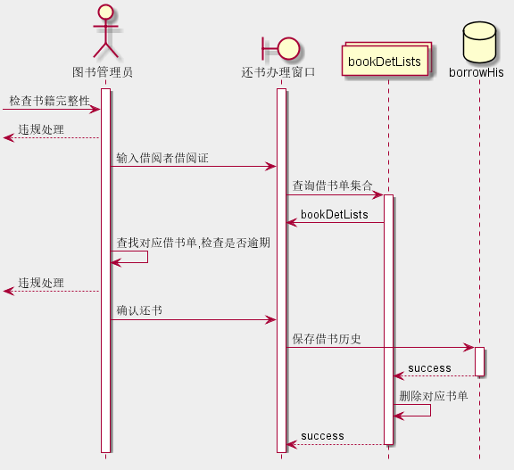

# 实验四 图书管理系统顺序图绘制
~~~
    1. 时序图中默认用户已登录,省略登录验证
    2. 时序图中的各种窗口等边界类是为了方便表示画出来的,没有对应的类图或对象图,其余都可在test3中找到
~~~
## 4.1图书查询
### 4.1.1代码
~~~
@startuml 图书查询(条件查询)
title 图书查询(条件查询)
hide footbox
skinparam backgroundColor #ded
actor borrower
boundary 图书查询窗口
activate borrower
activate 图书查询窗口
borrower -> 图书查询窗口: 输入检索条件
图书查询窗口 -> 图书查询窗口: 验证输入信息
borrower -> 图书查询窗口: 点击查看详情
database book
图书查询窗口 -> book: 查询图书
activate book
book --> 图书查询窗口: 返回图书
@enduml

@startuml 图书查询(全部查询)
title 图书查询(全部查询)
skinparam backgroundColor #ded
hide footbox
actor borrower
boundary 图书查询窗口
database book
activate borrower
borrower -> 图书查询窗口: 点击查询
activate 图书查询窗口
图书查询窗口 -> book: 获取图书
activate book
book --> 图书查询窗口: 返回图书
deactivate book
@enduml
~~~

### 4.1.2图例
.png)

.png)
### 4.1.3说明
~~~
    1. 借阅者--borrower,同样管理员和游客(游客并非实体)等也可以进行查询,这里并不一一列出.
    2. 图书--book,表示存储的图书数据,
    3. 图书查询方法包括条件查询和全部查询,用户根据需求选择查询方式,页面项服务器返回查询条件然后
从数据库查找到符合要求的数据生成List<book>类型的集合返回给用户
~~~

## 4.2借书
### 4.2.1代码
~~~
@startuml 借书
skinparam backgroundColor #eee
hide footbox
actor 图书管理员
boundary 借书办理窗口
database borrower
database bookDetList
activate 图书管理员
activate 借书办理窗口
[-> 图书管理员: 查询将借阅的图书信息
图书管理员 -> 图书管理员: 检查图书是否满足借阅条件
图书管理员 -> 借书办理窗口: 输入借阅者信息
借书办理窗口 -> borrower: 查询借阅者信息
activate borrower
borrower --> 借书办理窗口: borrower
deactivate borrower
图书管理员 -> 借书办理窗口: 判断是否符合借阅要求
借书办理窗口 -> bookDetList: 保存借书单
activate bookDetList
bookDetList --> 借书办理窗口: success
deactivate bookDetList
@enduml
~~~
### 4.2.2图例

### 4.2.3说明
~~~
    1. 借阅者--borrower,图书管理员通过借阅者卡号获取借阅者信息判断其是否具有借书前提
    2. 借书单--bookDetList,借书详单--bookDetListInfo参考test3相应对象图,通过两者存储借阅者的
某次借书操作及本次借书的详细条目
    3. 此操作发生在借阅者将所借书籍给图书管理员后,此时管理员先查询书籍是否符合借阅条件,在通过借阅者id
查看借阅者的权限,在符合要求后填写并提交借书单,有服务器内部生成相关对象在存储到对应数据库表并返回操作结果
~~~
## 4.3续借
### 4.3.1代码
~~~
@startuml 续借
skinparam backgroundColor #eef
hide footbox
actor 图书管理员
boundary 续借办理窗口
collections bookDetLists
database bookDetList
activate 图书管理员
activate 续借办理窗口
[-> 图书管理员: 检查书籍完整性
[<-- 图书管理员: 违规处理
图书管理员 -> 续借办理窗口: 输入借阅者借阅证
续借办理窗口 -> bookDetLists: 查询借阅者借书单
activate bookDetLists
bookDetLists --> 续借办理窗口:bookDetLists
图书管理员 -> 图书管理员: 点击借书单详情,验证是否逾期
[<-- 图书管理员: 违规处理
图书管理员 -> 续借办理窗口: 确认续借
续借办理窗口 -> bookDetList: 更新借书单借书期限
activate bookDetList
bookDetList --> 续借办理窗口: success
deactivate bookDetList
deactivate bookDetLists
@enduml
~~~
### 4.3.2图例

### 4.3.3说明
~~~
    1. 各类与上面用法一样,由于续借只是改变bookDetList的deadline 字段,不对详细信息进行修改,这里就没画出.
    2. 此处违规处理画出来是因为它被定义成一个单独的用例
~~~

## 4.4还书
### 4.4.1代码
~~~
@startuml 还书
skinparam backgroundColor #eee
hide footbox
actor 图书管理员
boundary 还书办理窗口
collections bookDetLists
database borrowHis
activate 图书管理员
activate 还书办理窗口
[-> 图书管理员: 检查书籍完整性
[<-- 图书管理员: 违规处理
图书管理员 -> 还书办理窗口: 输入借阅者借阅证
还书办理窗口 -> bookDetLists: 查询借书单集合
activate bookDetLists
bookDetLists -> 还书办理窗口: bookDetLists
图书管理员 -> 图书管理员: 查找对应借书单,检查是否逾期
[<-- 图书管理员: 违规处理
图书管理员 -> 还书办理窗口: 确认还书
还书办理窗口 -> borrowHis: 保存借书历史
activate borrowHis
borrowHis --> bookDetLists: success
deactivate borrowHis
bookDetLists->bookDetLists: 删除对应书单
bookDetLists-->还书办理窗口: success
deactivate bookDetLists
@enduml
~~~
### 4.4.2图例

### 4.4.3说明
~~~
    1. 部分说明与续借相同;特殊的:当确认还书时需要将书单中对应的数据转换成借书历史并保存,
同时就需要删除它在书单中的记录节约空间.
~~~

## 4.5违规处理
### 4.5.1代码
~~~
@startuml 违规处理
skinparam backgroundColor #eee
hide footbox
actor 图书管理员
boundary 违规处罚窗口
collections borrowHis
database ticket
activate 图书管理员
activate 违规处罚窗口
[->图书管理员: 违规信息
图书管理员->图书管理员: 决策处理办法
图书管理员->违规处罚窗口: 记录并提交
违规处罚窗口->borrowHis: 保存借书记录
activate borrowHis
borrowHis->ticket: 生成ticket,传入借书单号
activate ticket
ticket-->borrowHis: success
deactivate ticket
borrowHis->borrowHis:flag=ture 
borrowHis-->违规处罚窗口: success
@enduml
~~~
### 4.5.2图例

### 4.5.3说明
~~~
    1. 当出现违规时,需要结束书单,将其保存为借书历史,为了标记此书单有违规,在保存罚单时,置flag=ture
~~~

## 4.6书目管理
### 4.6.1代码
~~~
@startuml 书目管理(增加图书)
skinparam backgroundColor #eee
title 增加图书
hide footbox
actor 图书管理员
boundary 书目管理窗口
entity adimn
database book
activate 图书管理员
activate 书目管理窗口
activate adimn
图书管理员->书目管理窗口: 选择增加图书选项
书目管理窗口->图书管理员: 弹出身份验证页面
图书管理员->书目管理窗口: 输入图书管理员密码
书目管理窗口->书目管理窗口: 验证输入有效性
书目管理窗口->adimn: 比较身份信息
书目管理窗口->图书管理员: 显示身份验证操作结果及下一步界面
图书管理员->书目管理窗口: 填写图书详细信息,检查并提交
书目管理窗口->book: 保存书籍信息
activate book
book->书目管理窗口: success
deactivate book
@enduml

@startuml 书目管理(修改图书)
skinparam backgroundColor #eee
title 修改图书
hide footbox
actor 图书管理员
boundary 书目管理窗口
entity adimn
database book
activate 图书管理员
activate 书目管理窗口
activate adimn
图书管理员->书目管理窗口: 点击修改图书
书目管理窗口->图书管理员: 弹出身份验证页面
图书管理员->书目管理窗口: 输入管理密码
书目管理窗口->adimn: 验证管理员权限
书目管理窗口->图书管理员: 显示验证结果
图书管理员->书目管理窗口: 输入需修改图书详细
书目管理窗口->book: 查询书籍
activate book
book-->书目管理窗口: book
deactivate book
图书管理员->书目管理窗口: 修改书籍信息
书目管理窗口->书目管理窗口: 验证修改项合法性
书目管理窗口->book: 更新书籍
activate book
book-->书目管理窗口: success
deactivate book
@enduml

@startuml 书目管理(删除图书)
skinparam backgroundColor #eee
title 删除图书
hide footbox
actor 图书管理员
boundary 书目管理窗口
entity adimn
database book
activate 图书管理员
activate 书目管理窗口
activate adimn
图书管理员->书目管理窗口: 点击修改图书
书目管理窗口->图书管理员: 弹出身份验证页面
图书管理员->书目管理窗口: 输入管理密码
书目管理窗口->adimn: 验证管理员权限
书目管理窗口->图书管理员: 显示验证结果
图书管理员->书目管理窗口: 输入需修改图书详细
书目管理窗口->book: 查询书籍
activate book
book->书目管理窗口: 返回书籍
deactivate book
图书管理员->书目管理窗口: 确认删除
书目管理窗口->book: 删除书籍
activate book
book->书目管理窗口: success
deactivate book
@enduml
~~~
### 4.6.2图例
.png)

.png)

.png)

### 4.6.3说明
~~~
    1. 这三个时序图中的adimn是图书管理员的数据,用来验证身份等
    2. 为了保证安全性,及时登录了系统,在操作是也需要重新输入密码,且危险操作前每次都要执行一次
~~~

## 4.7系统管理
### 4.7.1代码
~~~
@startuml 系统管理
skinparam backgroundColor #eee
hide footbox
actor 超级管理员
boundary 系统管理界面
database borrower
activate 超级管理员
activate 系统管理界面
超级管理员->系统管理界面: 输入用户查找条件
系统管理界面->borrower: 查找符合条件的用户集合
activate borrower
borrower-->系统管理界面: 返回并显示查询结果
deactivate borrower
超级管理员->系统管理界面: 选择用户
系统管理界面->系统管理界面: 显示用户详细信息
超级管理员->系统管理界面: 修改用户'stauts'属性并点击提交
系统管理界面->超级管理员: 弹出权限验证
超级管理员->系统管理界面: 输入root密码
系统管理界面->系统管理界面: 验证权限
系统管理界面->borrower: 更新用户信息
activate borrower
borrower-->系统管理界面: success
deactivate borrower
@enduml
~~~
### 4.7.2图例

### 4.7.3说明
~~~
    1. 为了保证安全性,及时登录了系统,在操作是也需要重新输入密码,且危险操作前每次都要执行一次
~~~

## 4.8账户设置(用户自身)
### 4.8.1代码
~~~
@startuml 账户设置(用户自身)
skinparam backgroundColor #eee
hide footbox
actor 借阅者
boundary 账户设置界面
database borrower
activate 借阅者
activate 账户设置界面
借阅者->账户设置界面: 点击个人头像
账户设置界面->借阅者: 显示个人信息
借阅者->账户设置界面: 点击并修改个人信息
账户设置界面->借阅者: 弹出身份验证
借阅者->账户设置界面: 输入密码
账户设置界面->账户设置界面: 验证提交信息合法性
账户设置界面->borrower: 更新借阅者信息
activate borrower
borrower->账户设置界面: success
deactivate borrower
@enduml
~~~
### 4.8.2图例
.png)
### 4.8.3说明
~~~
    1. 用户设置,比如说用户修改自身的简介等,当用户点击头像会进入到个人空间可以查看或修改自己的资料,
为了保证安全也需要重新验证,完成后保存到数据库
~~~