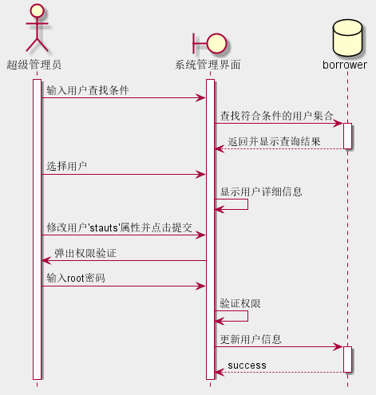

# 实验四 图书管理系统顺序图绘制
## 图书查询
### 代码
~~~
@startuml 图书查询(条件查询)
title 图书查询(条件查询)
hide footbox
actor 游客
boundary 客户端
control 服务器
collections bookMenu
database 图书数据

activate 游客
activate bookMenu
游客 -> 客户端: 输入检索条件
activate 客户端
客户端 -> 客户端: 验证输入信息
客户端 --> 游客: 显示错误提示信息
deactivate 游客
activate 服务器
客户端 -> 服务器: 传入检索条件
服务器 -> bookMenu: 在bookMenu中检索
deactivate 服务器
bookMenu --> 客户端: 查询成功就返回对应结果,失败则返回提示信息
activate 游客
游客 -> 客户端: 点击查看详情
deactivate 游客
activate 服务器
客户端 -> 服务器: 返回对应图书ISBN
activate 图书数据
服务器 -> 图书数据: 查询图书详情
deactivate 服务器
图书数据 --> 客户端: 返回图书详情
deactivate 图书数据
@enduml

@startuml 图书查询(全部查询)
title 图书查询(全部查询)
skinparam backgroundColor #ded
hide footbox
actor 游客
boundary 客户端
control 服务器
entity bookMenu
activate 游客
activate bookMenu
游客 -> 客户端: 点击查询
activate 客户端
activate 服务器
客户端 -> 服务器: 传入检索条件
服务器 -> bookMenu: 获取图书菜单
deactivate 服务器
bookMenu -> 客户端: 返回图书菜单
deactivate 游客
deactivate 服务器
@enduml
~~~

### 图例
.png)

.png)
### 说明
~~~
    1. bookMenu是存在于服务器内存的一个实体类,存储所有图书的简单信息,用来加快用户查询速度减少数据库的访问,它的生命线表示它一直存在于服务器
    2. 这里的虽然只列出了游客,但同样具有查询权限的真正用户也有相同图例(在此并不一一画出)
    3. 游客的生命线表示游客可能参与操作的时间段,游客只是在客户端上操作,操作结果也只是返回给客户端与游客无直接关联,于是游客与时序图内其他并无箭头联系
~~~

## 借书
### 代码

### 图例

### 说明

## 续借

## 还书

## 违规处理

## 书目管理
.png)

.png)

.png)

## 系统管理

## 账户设置(用户自身)
.png)