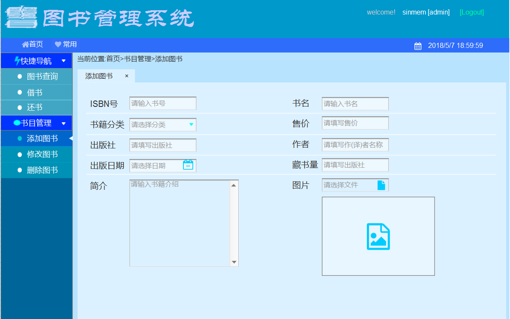

# 实验五图书管理系统数据库设计与界面设计
## 5.1 数据库设计说明
root:***由于其存在唯一,不给它单独一个数据库的表进行存放,直接存在配置文件内***
 user不是数据库对象,不存数据库
~~~
    1. 一共涉及到8张表
    2. 分别是:
        a. 借阅者--borrower
        b. 管理员--admin
        c. 书籍--book
        d. 借书单--bookDeList
        e. 借书详单--bookDeListInfo
        f. 借书历史--borrowHis
        g. 借书历史详单--borrowHisInfo
        h. 罚单--ticket
        i. 书类--lable
    3. 以MySQL5.7版本的数据库为基础设计,PK表示主键,FK表示外键,N表示否,Y表示是
    4. bookDeListInfo与borrowHisInfo在对象图中对应同一对象(所存储数据完全相同,但持久化时不适合存储到同一表内)
    5. 将主外键约束和约束合并为一个单元格
~~~
## 5.2数据库设计
### 5.2.1 借阅者--borrower表
|字段|类型|可以为空|约束|说明|
|:-------:|:------:|:----:|:---:|:-----|
|ID|varchar(15)|N|PK|服务器生成|
|pwd|varchar(20)|N|字母数字下划线||
|createTime|datetime|N||服务器生成|
|status|tinyint|N||说明参照test3对象图|
|firstName|varchar(10)|Y|汉字或字母|
|lastName|varchar(10)|Y|汉字或字母|
|IDCardNo|varchar(18)|Y||仅在客户端进行输入检测|
|email|varchar(25)|Y||仅在客户端进行输入检测|
|m_phoneNumber|varchar(15)|Y||仅在客户端进行输入检测|
|creditRating|varchar(4)|N|80(默认),范围0~100||

### 5.2.2 管理员--admin表
|字段|类型|可以为空|约束|说明|
|:-------:|:------:|:----:|:---:|:-----|
|ID|varchar(15)|N|PK|服务器生成|
|pwd|varchar(20)|N|字母数字下划线||
|createTime|datetime|N||服务器生成|
|status|tinyint|N||说明参照test3对象图|
|firstName|varchar(10)|Y|汉字或字母|
|lastName|varchar(10)|Y|汉字或字母|
|email|varchar(25)|Y||仅在客户端进行输入检测|

注:
    root字段只在类中出现,不在数据库中出现,创建adimn对象时默认为false,当验证管理权限成功后更改为ture

### 5.2.3 书籍--book
|字段|类型|可以为空|约束|说明|
|:-------:|:------:|:----:|:---:|:-----|
|ISBN|varchar(13)|N|PK|仅在客户端进行输入检测|
Name|varchar(100)|N||仅在客户端进行输入检测|
|Label|varchar(50)|N||通过下拉列表选择的,实在想不到还要怎么约束|
|logo|varchar(100)|Y||存储图片地址链接|
|info|varchar(150)|Y||仅在客户端进行输入检测|
|price|float|N||仅在客户端进行输入检测|
|publisher|varchar(50)|N||仅在客户端进行输入检测|
|author|varchar(50)|N||仅在客户端进行输入检测|
|publishDate|datetime|N||仅在客户端进行输入检测|
|stock|smallint|N||仅在客户端进行输入检测|
|Number|smallint|N|Number<=stock,且大于0|

### 5.2.4 借书单--bookDeList
|字段|类型|可以为空|约束|说明|
|:-------:|:------:|:----:|:---:|:-----|
|ID|varchar(16)|N|PK|服务器生成|
|borrower_ID|varchar(15)|N|FK|
|borrowDate|datetime|N||服务器生成|
|deadline|smallint|N|范围:0~30|说明参照test3对象图|
|status|tinyint|N||说明参照test3对象图|

### 5.2.5 借书详单--bookDeListInfo
|字段|类型|可以为空|约束|说明|
|:-------:|:------:|:----:|:---:|:-----|
|ID|int|N|PK|服务器生成|
|ISBN|varchar(13)|N|FK|
Number|smallint|N|大于0,小于生成详单时库存且小于3|

### 5.2.6 借书历史--borrowHis
|字段|类型|可以为空|约束|说明|
|:-------:|:------:|:----:|:---:|:-----|
|ID|varchar(16)|N|PK|从对应bookDeList项转换过来|
|borrower_ID|varchar(15)|N|FK|从对应bookDeList项转换过来|
|borrowDate|datetime|N||从对应bookDeList项转换过来|
|returnDate|datetime|Y||服务器生成|
|deadline|smallint|N||从对应bookDeList项转换过来|
|status|tinyint|N||参照test3对象图|
|flag|bitN|N||标记是否违规|

### 5.2.7 借书历史详单--borrowHisInfo
|字段|类型|可以为空|约束|说明|
|:-------:|:------:|:----:|:---:|:-----|
|ID|int|N|PK|从对应bookDeListInfo项转换过来|
|ISBN|varchar(13)|N|FK|从对应bookDeListInfo项转换过来|
Number|smallint|N||从对应bookDeListInfo项转换过来|

### 5.2.8 罚单--ticket
|字段|类型|可以为空|约束|说明|
|:-------:|:------:|:----:|:---:|:-----|
|ID|int|N|PK|服务器生成|
|bookDeList_ID|varchar(16)|N|FK|
|title|varchar(20)|N||仅在客户端进行输入检测|
|info|varchar(200)|N||仅在客户端进行输入检测|
|admin_ID|varchar(15)|N|FK||
### 5.2.9 书类--lable
|字段|类型|可以为空|约束|说明|
|:-------:|:------:|:----:|:---:|:-----|
|ID|int|N|PK|自增|
|info|varchar(50)|N||书的分类|
## 5.3 界面设计
### 5.3.1 书目管理
#### (1)书目管理--添加书籍

相关用例:test2/书目管理
相关类图:test3/book,test3/lable
相关时序图:test3/书目管理(增加图书)
#### (2)对应API
1. check ISBN existence API
    检查ISBN存在性,以防止重复创建书籍
- HTTP动词,请求方式及地址(该地址表示从项目根地址出发)
    异步 GET /checkISBN?ISBN=978-7-308-17148-9
- 请求参数
    |请求参数|必选|描述|
    |:-------:|:---:|:-----|
    |ISBN|TURE|需要验证的ISBN号|
- 返回参数
    |返回参数|描述|
    |:-------:|:-----|
    |title|返回项标题|
    |message|返回的服务器信息(ture:存在, false:不存在在, InternalERROR:内部错误)|
- *示例*
    - **Request**
        ~~~
        Content-Type: application/json
        {
            "book.ISBN": "978-7-308-17148-9"
        }
        ~~~
    - **Response**
        ~~~
        Stauts: 200 ok
        Content-Type: application/json
        {
            "title": "ISBN exist"
            "message": "ture"
        }
        ~~~
2. save logo of book API
    保存书籍图片
- HTTP动词,请求方式及地址(该地址表示从项目根地址出发)
    异步 POST /saveImg
- 请求参数
    |请求参数|必选|描述|
    |:-------:|:---:|:-----|
    |img|TURE|需要上传的图片文件,小于1M|
- 返回参数
    |返回参数|描述|
    |:-------:|:---:|:-----|
    |title|返回项标题|
    |message|返回的服务器信息:success:保存成功, FileOverMaxSize:图片过大, OnFile:文件不存在, InternalERROR:内部错误|
    |logoUrl|图片在服务器存储设备上的地址 存储成功后由服务器返回|
- *示例*
    - **Request**
        ~~~
        {
            "img": "(图片资源的二进制文件)"
        }
    ~~~
    - **Response**
        ~~~
        Stauts: 201 CREATED
        Content-Type: application/json
        {
            "title": "createed or no"
            "message": "success"
            "logoUrl": "[图片地址]"
        }
        ~~~
3. add book API
    保存图书
- HTTP动词,请求方式及地址(该地址表示从项目根地址出发)
    异步 POST /addbook
- 请求参数
    |请求参数|必选|描述|
    |:-------:|:---:|:-----|
    |data|TURE|填写的图书json串(每项必填,详见示例)|
- 返回参数
    |返回参数|描述|
    |:-------:|:-----|
    |title|返回项标题|
    |message|返回的服务器信息(ture:添加成功, false:添加失败, InternalERROR:内部错误|
- *示例*
    - **Request**
        ~~~
        Content-Type: application/json
        "data": {
            [{
                "book.ISBN": "978-7-308-17148-9"
                "book.name": "Linux程序设计"
                "book.Label": "计算机-Linux编程-基础教材"
                "book.logo": "${logoUrl}"
                "book.info": "一本简单明了的Linux搞程序开发的编程基础"
                "book.price": "78.00"
                "book.publisher": "浙江大学出版社"
                "book.author": "金国庆 刘加海 李江明 谢井"
                "book.publishDate": "2018-04-14 01:16:00"
                "book.stock": "7"
            }]
        }
        注:
            data: 请求的数据集合
            ${logoUrl}表示通过获取save logo of book返回的logoUrl值为参数值
            book.Number并不传输,在后台创建资源项时复制book.stock的值即可
        ~~~
    - **Response**
        ~~~
        Stauts: 200 ok
        Content-Type: application/json
        {
            "title": "createed or no"
            "message": "ture"
        }
        ~~~