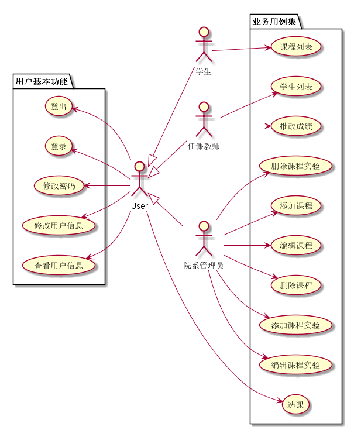
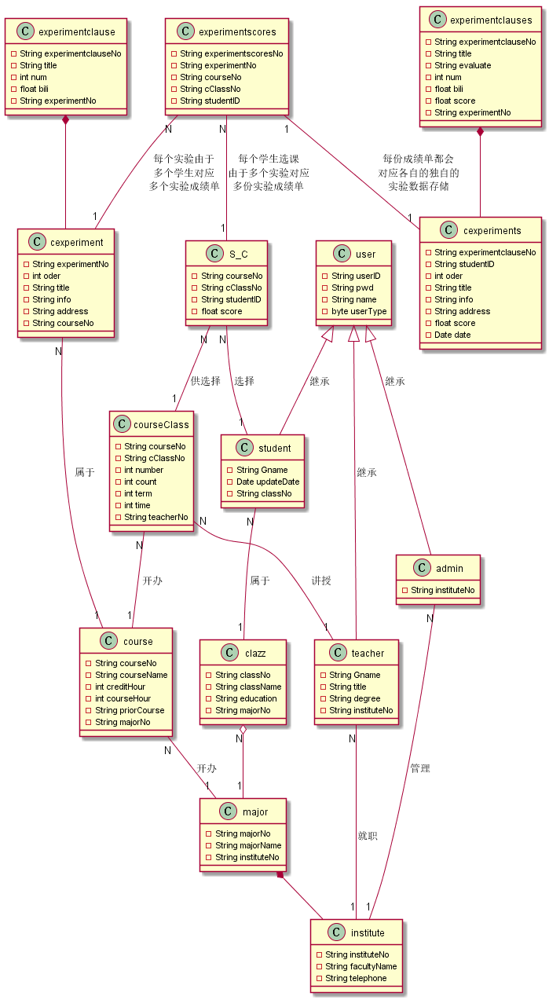
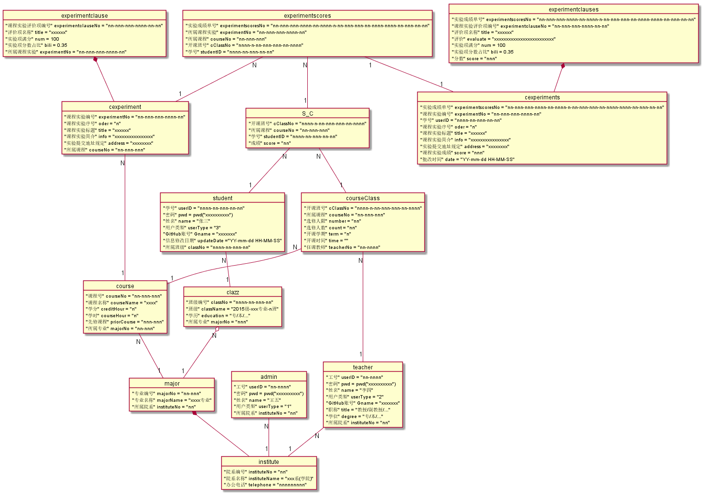

# 基于GitHub的实验管理平台的分析与设计 [主页](/README.md)

## 1. 概述

- 本文档是对基于GitHub的实验管理平台进行软件系统分析所产生的文档.
- 大家都是到GitHub是干什么的, 这里主要利用它的开源代码管理功能, 将学生的实验作业和教师的实验安排及示例等托管到上面, 本系统主要提供对学生实验的平台化管理, 方便师生键的实验安排与进行等.
- 本系统涉及到多个教师,多名学生,多门课程的多个实验,每个实验也有多个不尽相同的评分项,详细的介绍见对象设计.
- 用户除了对基本角色信息的维护外, 学生还能选择不同的开课班bin查看他们,然后完成各个教师安排下来的的实验上传到GitHub上指定链接等待教师批阅,以及最后查看各科的,各实验的成绩了.(ps:学生只能看见自己的信息)
- 教师当然也要那个选课,毕竟这是学生选课的前提, 去此外还能获得自己各开课班的学生列表,从而可以查看学生的实验成绩以及对学生的实验成绩进行批改,查看批改结果等等
- 为了增加课程,实验,评分项的灵活性,特此增加一个院系管理员的角色, 它可以对课程以及课程实验的各个信息进行增删改.(ps1: 这里其实可以将对课程实验的增删改功能赋给教师,这样实验更具有灵活性,但是后来觉得懒得改,现在这样的统一性也并不是全是坏事,毕竟操作简单了一万倍. ps2: 师生数据什么的...从教务系统导入把,就不加对他们的操作了. ps3: 凑个数...)
- 看见老师的示例里面有一个系统结构图,但是考试要求里面没写不是吗? 所以没画...
- 想知道更加详细的介绍看线面吧.

## 2. 用例设计 [源码](/test6/userCase.pu)

- 说明
~~~
    1. user是为了方便表述用户基本功能,方便描述和文档操作抽象出来的角色
    2. 登录用例的参与者是游客(任何人),只有当游客登录后才能进行用例设计里面的其他用例
    3. 登出用例用来注销用户登录,注销后用户将不能进行其他用例除了登录外的操作
    4. 修改密码是学生,任课教师,院系管理员等角色修改登录时凭证的方法
    5. 修改用户信息用来修改用户...只能修改GitHub名称的用例,查看用户信息可以用来查看用户除了密码等私密信息之外的所有信息的用例
    6. 课程列表是学生用来获取本学期所选课程,然后就能够通过点击各课程的链接跳转到该课程的实验列表进而再查看实验课程的详情或者提交课程实验等等
    7. 学生列表可以是老师用来获取所开课程所有学生信息进而进行课程实验批改成绩和查看学生的成绩等操作
    8. 增添加,编辑,和删除课程是院系管理员用于管理院系各专业课程的用例
    9. 同理增添加,编辑,和删除课程实验院系管理员用于管理院系各专业课程的实验项目用例,是学生提交实验的前提
~~~

## 3. 类图 [源码](/test6/classView.pu)

- 说明
~~~
    1. setter,getter方法被省略, 被继承属性省略
    2. 属性示意后面给出
    3. ***No等外键被列在后面
    4. 类图及其来源说明:
        1. user 它是抽象的, 方便表述信息的抽象物
        2. student -使用/修改-> 用例: 用户基本功能用例集内全部,课程列表,选课等
        3. teacher -使用/修改-> 用例: 用户基本功能用例集内全部,学生列表,批改成绩,选课等
        4. admin -使用/修改-> 用例: 用户基本功能用例集内全部等
        5. clazz -使用-> 用例: 对课程和课程实验的相关等
        6. major -使用-> 用例: 对课程和课程实验的相关等
        7. institute -使用-> 用例: 对课程和课程实验的相关等
        8. course -增删改-> 用例: 对课程的相关等
        9. courseClass -增加,使用-> 用例: 师生选课等 
        10. S_C -增加-> 用例: 选课用例等
        11. cexperiment -增删改-> 用例: 对课程实验的相关等
        12. experimentclause -增删改-> 用例: 对课程实验的相关等
        13. cexperiments -增改-> 用例: 课程列表,批改成绩等
        14. experimentclauses -增改-> 用例: 课程列表,批改成绩等
        15. experimentscores -创建-> 用例: 选课,课程列表等
~~~

## 4. 对象图设计 [源码](/test6/objectMView.pu)

- 说明
~~~
    1. 说明丢到了对象图详细设计里面...
    2. 关系基本上就是上面的关系...
~~~
- [对象图详细设计](/test6/对象图详细设计.md)

## 5. 数据库设计 

- [参见数据库设计](/test6/数据库设计.md) 

## 6. 用例及界面详细设计

- ["登录"用例, ](用例/登录.md) [界面](https://sinmem.github.io/is_analysis/test6/ui/登录.html)
- ["登出"用例, ](用例/登出.md) [界面](https://sinmem.github.io/is_analysis/test6/ui/登出.html)
- ["修改密码"用例, ](用例/修改密码.md) [界面](https://sinmem.github.io/is_analysis/test6/ui/修改密码.html)
- ["修改用户信息"用例, ](用例/修改用户信息.md) [界面](https://sinmem.github.io/is_analysis/test6/ui/修改用户信息.html)
- ["查看用户信息"用例, ](用例/查看用户信息.md) [界面](https://sinmem.github.io/is_analysis/test6/ui/修改用户信息.html)
- ["课程列表"用例, ](用例/课程列表.md) [界面](https://sinmem.github.io/is_analysis/test6/ui/课程列表.html)
- ["学生列表"用例, ](用例/学生列表.md) [界面](https://sinmem.github.io/is_analysis/test6/ui/学生列表.html)
- ["批改成绩"用例, ](用例/批改成绩.md) [界面](https://sinmem.github.io/is_analysis/test6/ui/批改成绩.html)
- ["选课"用例, ](用例/选课.md) [界面](https://sinmem.github.io/is_analysis/test6/ui/选课.html)
- ["添加课程"用例, ](用例/添加课程.md) [界面](https://sinmem.github.io/is_analysis/test6/ui/添加课程.html)
- ["编辑课程"用例, ](用例/编辑课程.md) [界面](https://sinmem.github.io/is_analysis/test6/ui/编辑课程.html)
- ["删除课程"用例, ](用例/删除课程.md) [界面](https://sinmem.github.io/is_analysis/test6/ui/删除课程.html)
- ["添加课程实验"用例, ](用例/添加课程实验.md) [界面](https://sinmem.github.io/is_analysis/test6/ui/添加课程实验.html)
- ["编辑课程实验"用例, ](用例/编辑课程实验.md) [界面](https://sinmem.github.io/is_analysis/test6/ui/编辑课程实验.html)
- ["删除课程实验"用例, ](用例/删除课程实验.md) [界面](https://sinmem.github.io/is_analysis/test6/ui/删除课程实验.html)