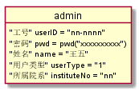
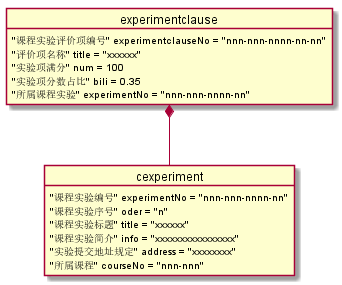
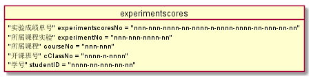
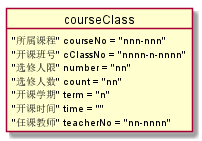

# 对象图详细设计

## 1. 学生对象图

### 1.1. 代码及说明
~~~
    @startuml student
    object student{
        "学号" userID = "nnnn-nn-nnn-nn-nn"
        "密码" pwd = pwd("xxxxxxxxxx")
        "姓名" name = "张三"
        "GitHub账号" Gname = "xxxxxxx"
        "信息修改日期" updateDate ="YY-mm-dd HH-MM-SS"
        "所属班级" classNo = "nnnn-nn-nnn-nn"
    }
    @enduml
    1. 学号由:"入学年-院系号-专业号-班级序号-学生在班内序号"构成
~~~
### 1.2. 对象图

## 2. 教师对象图

### 2.1. 代码及说明
~~~
    @startuml teacher
    object teacher{
        "工号" userID = "nn-nnnn"
        "密码" pwd = pwd("xxxxxxxxxx")
        "姓名" name = "李四"
        "GitHub账号" Gname = "xxxxxxx"
        "职称" title = "教授/副教授/..."
        "学位" degree = "专/本/..."
        "所属院系" instituteNo = "nn"
    }
    @enduml
    1. 教师工号由:"院系号-教师在院内序号"构成
~~~
### 2.2. 对象图

## 3. 院系管理员对象图

### 3.1. 代码及说明
~~~
    @startuml admin
    object admin{
        "工号" userID = "nn-nnnn"
        "密码" pwd = pwd("xxxxxxxxxx")
        "姓名" name = "王五"
        "所属院系" instituteNo = "nn"
    }
    @enduml
    1. 管理员工号由:"院系号-管理员编号"构成
~~~
### 3.2. 对象图

## 4. 课程实验对象图

### 4.1. 代码及说明
~~~
    @startuml cexperiment
    object cexperiment{
        "课程实验编号" experimentNo = "nnn-nnn-nnnn-nn"
        "课程实验序号" oder = "n"
        "课程实验标题" title = "xxxxxx"
        "实验提交地址规定" address = "xxxxxxxx"
        "所属课程" courseNo = "nnn-nnn"
    }
    object experimentclause{
        "课程实验评价项编号" experimentclauseNo = "nnn-nnn-nnnn-nn-nn"
        "评价项名称" title = "xxxxxx"
        "所属课程实验" experimentNo = "nnn-nnn-nnnn-nn"
    }
    experimentclause *-- cexperiment
    @enduml
    1. 课程实验编号由:"课程编号-所处年-年内编号"构成
    2. 课程实验评价项编号:"课程实验编号-其在评分项中的顺序"构成
    3. 课程实验评价项是课程实验的各个评分项细则
~~~
### 4.2. 对象图

## 5. 课程实验成绩对象图

### 5.1. 代码及说明
~~~
    @startuml cexperiments
    object cexperiments{
        "课程实验编号" experimentNo = "nnn-nnn-nnnn-nn"
        "学号" userID = "nnnn-nn-nnn-nn-nn"
        "课程实验序号" oder = "n"
        "课程实验标题" title = "xxxxxx"
        "课程实验简介" info = "xxxxxxxxxxxxxxxx"
        "实验提交地址规定" address = "xxxxxxxx"
        "课程实验成绩" score = "nnn"
        "批改时间" date = "YY-mm-dd HH-MM-SS"
    }
    object experimentclauses{
        "课程实验评价项编号" experimentclauseNo = "nnn-nnn-nnnn-nn-nn"
        "评价项名称" title = "xxxxxx"
        "评价" evaluate = "xxxxxxxxxxxxxxxxxxxxxxxxx"
        "分数" score = "nnn"
        "所属课程实验" experimentNo = "nnn-nnn-nnnn-nn"
    }
    experimentclauses *-- cexperiments
    @enduml
    1. 同上面一个...只是上面是单纯用来存储实验信息的,后者是用来存储学生做了实验后被老师批改后的信息
~~~
### 5.2. 对象图

## 6. 课程实验成绩单对象图

### 6.1. 代码及说明
~~~
    @startuml experimentscores
    object experimentscores{
        "实验成绩单号" experimentscoresNo = "nnn-nnn-nnnn-nn-nnnn-n-nnnn-nnnn-nn-nnn-nn-nn"
        "所属课程实验" experimentNo = "nnn-nnn-nnnn-nn"
        "所属课程" courseNo = "nnn-nnn"
        "开课班号" cClassNo = "nnnn-n-nnnn"
        "学号" studentID = "nnnn-nn-nnn-nn-nn"
    }
    @enduml
    1. 实验成绩单号由:"所属课程实验-开课班号-学生学号"构成
~~~
### 6.2. 对象图

## 7. 院系对象图

### 7.1. 代码及说明
~~~
    @startuml institute
    object clazz{
        "班级编号" classNo = "nnnn-nn-nnn-nn"
        "班级" className = "2015级-xxx专业-n班"
        "学历" education = "专/本/..."
        "所属专业" majorNo = "nnn"
    }
    object major{
        "专业编号" majorNo = "nnn"
        "专业名称" majorName = "xxxx专业"
        "所属院系" instituteNo = "nn"
    }
    object institute{
        "院系编号" instituteNo = "nn"
        "院系名称" instituteName = "xxx系(学院)"
        "办公电话" telephone = "nnnnnnnnn"
    }
    clazz "N" o-- "1" major
    major *-- institute
    @enduml
    1. 班级编号:"该班开办年-院系编号-专业编号-班级序号"构成
~~~
### 7.2. 对象图

## 8. 课程对象图

### 8.1. 代码及说明
~~~
    @startuml course
    object course{
        "课程号" courseNo = "nnn-nnn"
        "课程名称" courseName = "xxxx"
        "学分" creditHour = "n"
        "学时" courseHour = "n"
        "先修课程" priorCourse = "nnn-nnn"
        "所属专业" majorNo = "nnn"
    }
    @enduml
    1. 课程号由:"所属专业-专业课程序号"构成
~~~
### 8.2. 对象图

## 9. 开课班对象图

### 9.1. 代码及说明
~~~
    @startuml courseClass
    object courseClass{
        "所属课程" courseNo = "nnn-nnn"
        "开课班号" cClassNo = "nnnn-n-nnnn"
        "选修人限" number = "nn"
        "选修人数" count = "nn"
        "开课学期" term = "n"
        "开课时间" time = ""
        "任课教师" teacherNo = "nn-nnnn"
    }
    @enduml
~~~
### 9.2. 对象图

## 10. 学生选课对象图

### 10.1. 代码及说明
~~~
    @startuml S_C
    object S_C{
        "所属课程" courseNo = "nnn-nnn"
        "开课班号" cClassNo = "nnnn-n-nnnn"
        "学号" studentID = "nnnn-nn-nnn-nn-nn"
        "成绩" score = "nn"
    }
    @enduml
~~~
### 10.2. 对象图
