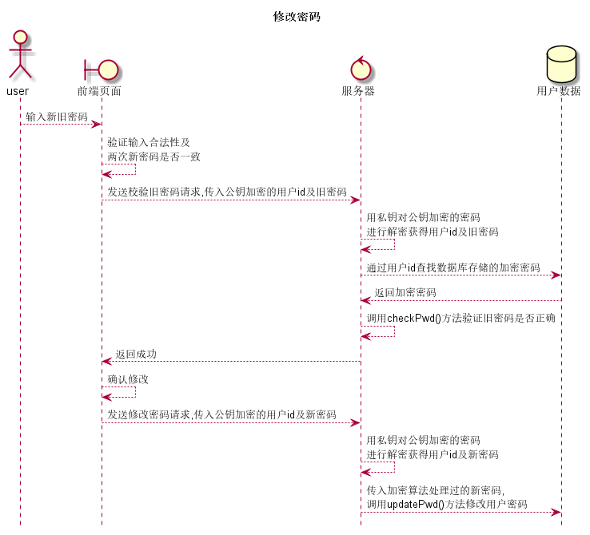

# “修改密码”用例 [返回](../README.md)

## 1. 用例规约

|用例名称|修改密码|
|-------|:-------------|
|功能|修改用户的登录密码|
|参与者|学生,任课教师,院系管理员|
|前置条件|登录了系统平台,进入了登录界面|
|后置条件|密码修改成功后旧密码不能再次使用,只能使用新密码才能登录|
|主事件流|<ol><li>输入新旧密码</li><li>系统验证输入合法性</li><li>系统验证旧密码正确性</li><li>将新密码录入到用户数据中</li></ol>|
|备选事件流|<ol><li>旧密码错误<ol><li>提示旧密码错误</li><li>重新输入旧密码</li></ol></li><li>输入不能为空<ol><li>输入提示输入内容为空</li><li>重新输入内容</li></ol></li><li>输入内容不合法<ol><li>提示输入内容不合法</li><li>重新输入不合法内容</li></ol></li></ol>|

## 2. 业务流程(顺序图)

## 3. 界面设计

- 界面参照: [/test6/ui/修改密码.html](https://sinmem.github.io/is_analysis/test6/ui/修改密码.html)
- https://sinmem.github.io/is_analysis/test6/ui/index.html
- API调用:
    - API1: [check_lastPwd](../api/check_lastPwd.md)
    - API2: [update_Pwd](../api/update_Pwd.md)

## 4. 算法描述
    
- 服务器中checkPwd()由于前端传过来的肯定没有用加密算法,而数据库中的却是加了密的,所以应是将数库中的取出再把前端传过来的私钥解密的密码用加密算法进行比较...
- 同理updatePwd()也是需要用特殊的加密算法将加密的数据存到数据库

## 5. 参照表

- [student](../数据库设计.md/#student)
- [teacher](../数据库设计.md/#teacher)
- [admin](../数据库设计.md/#admin)