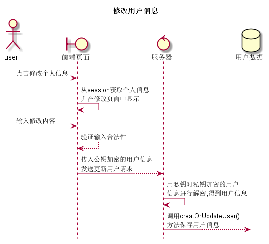

# “修改用户信息”用例 [返回](../README.md)

## 1. 用例规约

|用例名称|修改用户信息|
|-------|:-------------|
|功能|修改用户的基本信息|
|参与者|学生,任课教师,院系管理员|
|前置条件|已登录系统平台,进入到修改用户信息界面|
|后置条件|修改完成用户信息后,用户可以点击查看到更新后的信息|
|主事件流|<ol><li>从session中获取该用户信息</li><li>将可修改的用户信息显示到修改信息的表单中</li><li>修改用户信息</li><li>验证修改内容</li><li>提交用户修改</li></ol>|
|备选事件流|<ol><li>输入不能为空<ol><li>输入提示输入内容为空</li><li>重新输入内容</li></ol></li><li>输入内容不合法<ol><li>提示输入内容不合法</li><li>重新输入不合法内容</li></ol></li></ol>|

## 2. 业务流程(顺序图)

## 3. 界面设计

- 界面参照
- API调用:
    - API1: [update_user](../api/update_user.md)

## 4. 算法描述
    
## 5. 参照表

- [student](../数据库设计.md/#student)
- [teacher](../数据库设计.md/#teacher)
- [admin](../数据库设计.md/#admin)