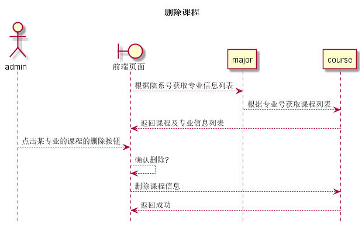

# “删除课程”用例 [返回](../README.md)

## 1. 用例规约

|用例名称|删除课程|
|-------|:-------------|
|功能|删除已有课程|
|参与者|院系管理员|
|前置条件|以admin登录到系统,点击删除按钮|
|后置条件|被删除课程信息不能再被查看到|
|主事件流|<ol><li>点击删除</li><li>弹出确认删除提示</li><li>删除所选课程</li></ol>|
|备选事件流|无|

## 2. 业务流程(顺序图)

## 3. 界面设计

- 界面参照 https://sinmem.github.io/is_analysis/test6/ui/删除课程.html
- API调用:
    - API1: [del_course](../api/del_course.md)
    - API2: [get_course](../api/get_course.md)

## 4. 算法描述
    
删除应该没有什么好说的吧...

## 5. 参照表

- [major](../数据库设计.md/#major)
- [course](../数据库设计.md/#course)