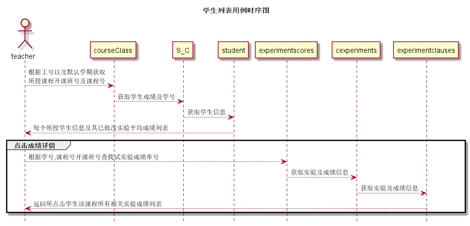

# “学生列表”用例 [返回](../README.md)

## 1. 用例规约

|用例名称|学生列表|
|-------|:-------------|
|功能|获取学生列表|
|参与者|任课教师|
|前置条件|以teacher身份登录到系统|
|后置条件|获取到该学期自己开课班的所有学生列表|
|主事件流|教师登录到系统后自动从服务器获取学生列表显示到教师主页上|
|备选事件流|无|

## 2. 业务流程(顺序图)

## 3. 界面设计

- 界面参照
- API调用:
    - API1: [get_students](../api/get_students.md)
    - API2: [get_experimentscores](../api/get_experimentscores.md)
## 4. 算法描述

- 为了提高学生列表的加载速度,选择了多级加载,先只加载到学生选课表,只有老师需要更详细的信息才加载
    
## 5. 参照表

- [courseClass](../数据库设计.md/#courseClass)
- [S_C](../数据库设计.md/#S_C)
- [student](../数据库设计.md/#student)
- [experimentscores](../数据库设计.md/#experimentscores)
- [cexperiments](../数据库设计.md/#cexperiments)
- [experimentclauses](../数据库设计.md/#experimentclauses)