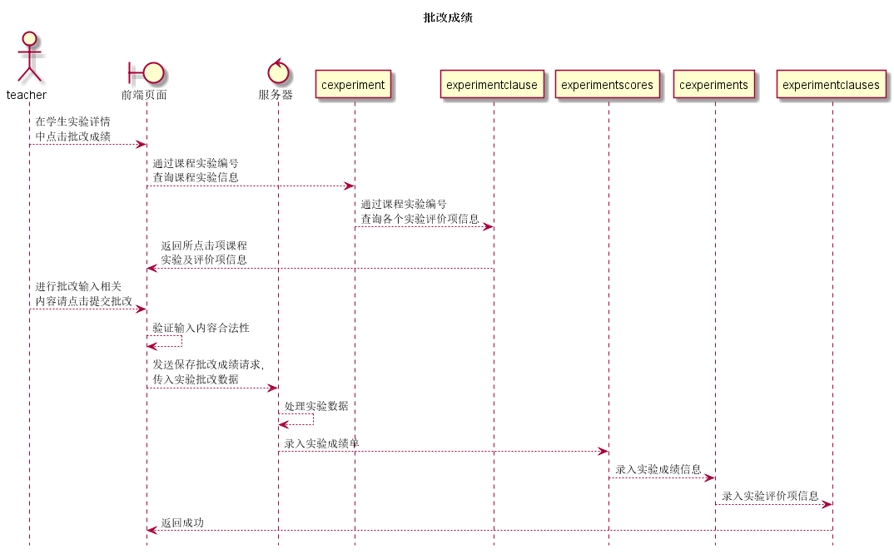

# “批改成绩”用例 [返回](../README.md)

## 1. 用例规约

|用例名称|批改成绩|
|-------|:-------------|
|功能|教师为学生实验进行评分|
|参与者|任课教师|
|前置条件|以教师身份登录到系统,bin进入到批改成绩界面|
|后置条件|批改完成后,师生课通过相关过程查看到批改后评分等|
|主事件流|<ol><li>输入评分内容</li><li>检查输入信息</li><li>录入信息</li></ol>|
|备选事件流|<ol><li>输入不能为空<ol><li>输入提示输入内容为空</li><li>重新输入内容</li></ol></li><li>输入内容不合法<ol><li>提示输入内容不合法</li><li>重新输入不合法内容</li></ol></li></ol>|

## 2. 业务流程(顺序图)

## 3. 界面设计

- 界面参照
- API调用:
    - API1: [get_cexperiment](../api/get_cexperiment.md)
    - API2: [add_cexperiments](../api/add_cexperiments.md)

## 4. 算法描述

- 为了保证信息的准确,通过get_cexperiment加载出所需要的选择列表等...
    
## 5. 参照表

- [cexperiment](../数据库设计.md/#cexperiment)
- [experimentclause](../数据库设计.md/#experimentclause)
- [experimentscores](../数据库设计.md/#experimentscores)
- [cexperiments](../数据库设计.md/#cexperiments)
- [experimentclauses](../数据库设计.md/#experimentclauses)