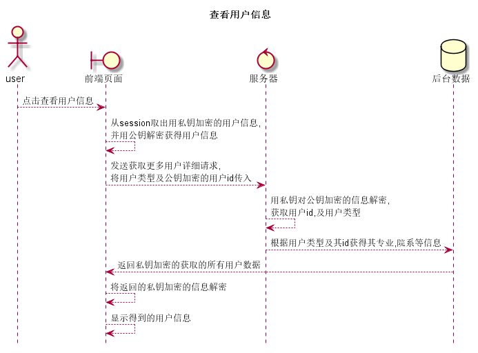

# “查看用户信息”用例 [返回](../README.md)

## 1. 用例规约

|用例名称|查看用户信息|
|-------|:-------------|
|功能|查看并显示所有"可见"的用户信息|
|参与者|学生,任课教师,院系管理员|
|前置条件|登录到了本系统|
|后置条件|无|
|主事件流|<ol><li>[点击]用户信息</li><li>显示所用"可见"的用户信息</li></ol>|
|备选事件流|无|

## 2. 业务流程(顺序图)

## 3. 界面设计

- 界面参照 https://sinmem.github.io/is_analysis/test6/ui/查看用户信息.html
- API调用:
    - API1: [get_MUserInfo](../api/get_MUserInfo.md)

## 4. 算法描述
    
- 该出所需的公钥是来自于登录时传输过来的那个

## 5. 参照表

- [student](../数据库设计.md/#student)
- [teacher](../数据库设计.md/#teacher)
- [admin](../数据库设计.md/#admin)