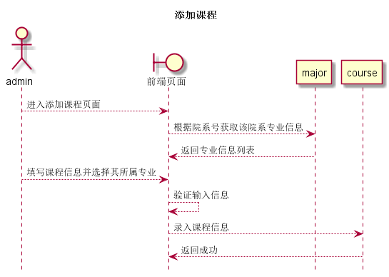

# “添加课程”用例 [返回](../README.md)

## 1. 用例规约

|用例名称|添加课程|
|-------|:-------------|
|功能|在course表中增加课程|
|参与者|院系管理员|
|前置条件|以admin身份登录到系统,进入到添加课程界面|
|后置条件|增加课程后可以查看到相关专业的刚刚增加的课程|
|主事件流|<ol><li>输入课程信息,选择课程所属专业</li><li>检查输入信息</li><li>录入课程信息</li></ol>|
|备选事件流|<ol><li>输入不能为空<ol><li>输入提示输入内容为空</li><li>重新输入内容</li></ol></li><li>输入内容不合法<ol><li>提示输入内容不合法</li><li>重新输入不合法内容</li></ol></li></ol>|

## 2. 业务流程(顺序图)

## 3. 界面设计

- 界面参照
- API调用:
    - API1: [get_majors](../api/get_majors.md)
    - API2: [add_course](../api/add_course.md)

## 4. 算法描述
    
## 5. 参照表

- [major](../数据库设计.md/#major)
- [course](../数据库设计.md/#course)