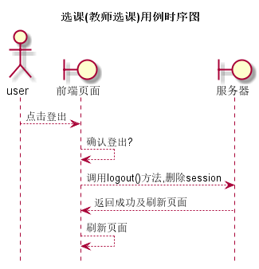

# “登出”用例 [返回](../README.md)

## 1. 用例规约

|用例名称|登出|
|-------|:-------------|
|功能|注销角色登录|
|参与者|学生,任课教师,院系管理员|
|前置条件|用户已经登录了系统|
|后置条件|登出后不能再进行除了登录外的操作|
|主事件流|<ol><li>用户点击登出</li><li>系统确认登出</li><li>删除session中数据,并且返回登录界面</li></ol>|
|备选事件流|无
|

## 2. 业务流程(顺序图)

## 3. 界面设计

- 界面参照 https://sinmem.github.io/is_analysis/test6/ui/登出.html
- API调用:
    - API1: [logout](../api/logout.md)

## 4. 算法描述

- 登出由于是危险操作于是要确认
- 登录后需要删除session中的所有数据回到登录界面,保证数据安全

## 5. 参照表

- [student](../数据库设计.md/#student)
- [teacher](../数据库设计.md/#teacher)
- [admin](../数据库设计.md/#admin)