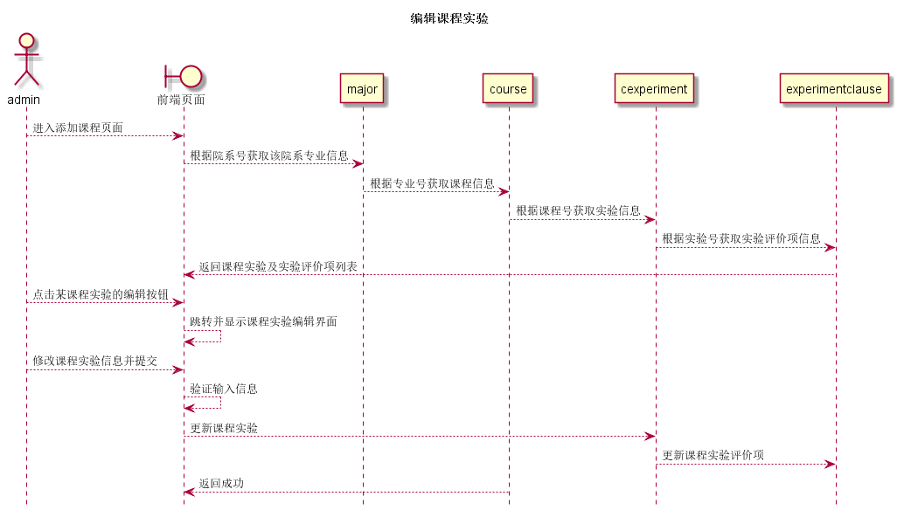

# “编辑课程实验”用例 [返回](../README.md)

## 1. 用例规约

|用例名称|编辑课程实验|
|-------|:-------------|
|功能|修改已有课程实验内容|
|参与者|院系管理员|
|前置条件|以admin身份登录系统,进入到编辑课程实验页面|
|后置条件|修改完成后,可以查看到已修改后的内容|
|主事件流|<ol><li>输入课程实验内容</li><li>检查输入信息</li><li>录入信息</li></ol>|
|备选事件流|<ol><li>输入不能为空<ol><li>输入提示输入内容为空</li><li>重新输入内容</li></ol></li><li>输入内容不合法<ol><li>提示输入内容不合法</li><li>重新输入不合法内容</li></ol></li></ol>|

## 2. 业务流程(顺序图)

## 3. 界面设计

- 界面参照 https://sinmem.github.io/is_analysis/test6/ui/编辑课程实验.html
- API调用:
    - API1: [get_cexperiment](../api/get_cexperiment.md)
    - API2: [update_cexperiment](../api/update_cexperiment.md)

## 4. 算法描述

- 院系管理员要编辑课程实验就要获取通过管理员的所属院系号从major中获取课程在获取实验,并将全部信息封装好后返回到前端页面
- 更新只需要根据试验号更新就好

## 5. 参照表

- [major](../数据库设计.md/#major)
- [course](../数据库设计.md/#course)
- [cexperiment](../数据库设计.md/#cexperiment)
- [experimentclause](../数据库设计.md/#experimentclause)