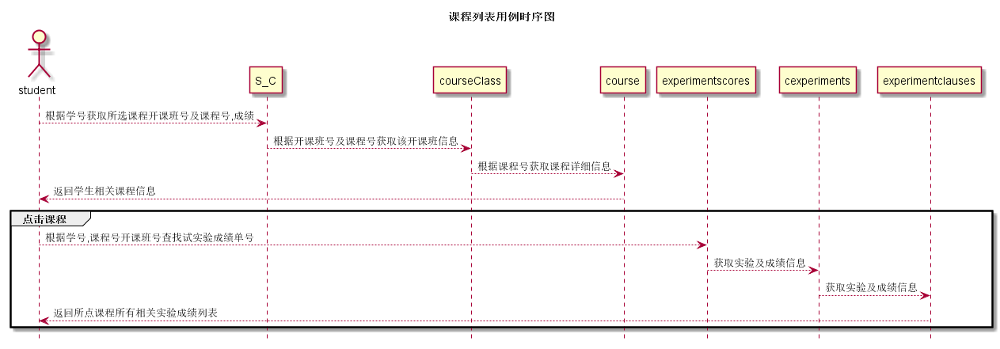

# “课程列表”用例 [返回](../README.md)

## 1. 用例规约

|用例名称|课程列表|
|-------|:-------------|
|功能|获取学生本学期已选课程列表|
|参与者|学生|
|前置条件|以学生身份登录到系统|
|后置条件|获取学生本学期已选课程列表|
|主事件流|学生登录到系统后服务器自动加载他的本学期所选课程|
|备选事件流|无|

## 2. 业务流程(顺序图)

## 3. 界面设计

- 界面参照 https://sinmem.github.io/is_analysis/test6/ui/课程列表.html
- API调用:
    - API1: [get_S_Cs](../api/get_S_Cs.md)
    - API2: [get_experimentscores](../api/get_experimentscores.md)
    

## 4. 算法描述

- 为了提高课程的加载速度,选择了多级加载,先加载简单的课程,里面加载课程实验的空类,只有当学生需要查看某一个所需要的课程的成绩时才加载
    
## 5. 参照表

- [S_C](../数据库设计.md/#S_C)
- [courseClass](../数据库设计.md/#courseClass)
- [course](../数据库设计.md/#course)
- [experimentscores](../数据库设计.md/#experimentscores)
- [cexperiments](../数据库设计.md/#cexperiments)
- [experimentclauses](../数据库设计.md/#experimentclauses)